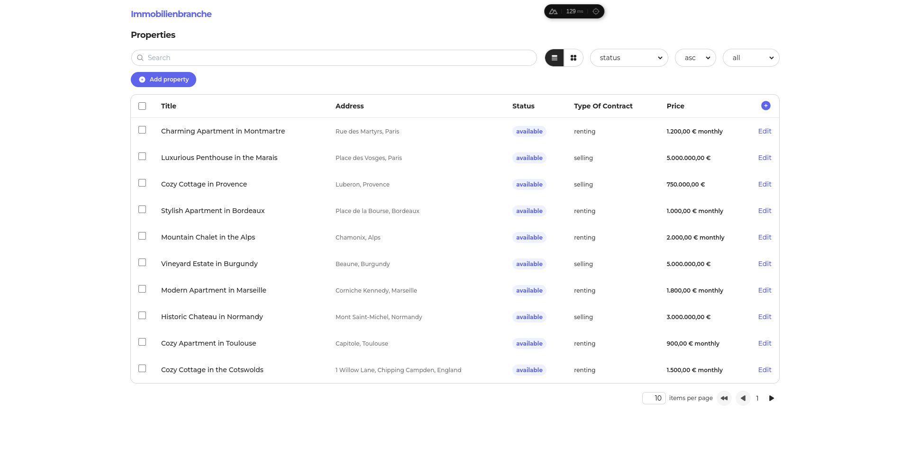

[DEMO]('https://wordliner.vercel.app')

## Installation

To install the project, follow these steps:

```
git clone https://github.com/caiankeller/wordliner-cc.git wordliner@caiankeller
```
```
cd wordliner@caiankeller
```
```
npm install
```

## Usage

To run the project, use the command:

```
npm run dev
```

The command will launch Nuxt server on http://localhost:3000/

## Features

This project showcases a streamlined Nuxt.js development process, featuring organized project structure, enhanced type safety, code linting, efficient font management, and tailored styling. Some of the features I put really effort to are 

### Table customization

To enhance user experience and productivity, I implemented table customization features. Users can:

-Order by different attributes

-Filter by status

-Hide and show columns for better visualization

### Localization

I added German language support to the application. While my German language skills are still developing, I'm committed to providing a localized experience for German-speaking users.

### and some new commands are

```
npm run lint
```
```
npm run lint:fix
```
```
npm run test
```


## Project Structure

While the official [Nuxt documentation](https://nuxt.com/docs/guide/directory-structure/app) recommends a flat structure in the `app` directory, I prefer a more organized approach using the `src` folder, I just wanted to outline that it's not a personal choice of me.

### Components
The `components` folder houses reusable UI elements. As the project grows, I would plan to organize components based on functionality or component relationships. However, I acknowledge this might slightly impact reusability in some cases.

### Services
Inspired by my experience with Next.js, I use the `services` folder to store individual files for API calls. Although Next.js requires server-side and client-side directives in each file (which is very important), this makes me believe that abstract API calls like this are a great idea. In Vue.js, things are quite different, so I know I could have chosen something more reliable. Alternative solutions, such as dedicated API modules, composables or a combination of them, may be more suitable.

### Auto-imports
I've adopted auto-imports. While I personally favor explicit imports, I did it the way I did thinking more in team collaboration necessitates. However, auto-imports introduced issues with testing, requiring adjustments that create further challenges. It's a trade-off.

### **Considerations**

Even though this is my first Vue project, I'm happy with the results, despite some minor inconsistencies that I only can address with time. As a React developer, transitioning to Vue felt surprisingly smooth. I was particularly impressed by v directive from Vue that are really easy to work with. Nuxt's native features, that greatly enhance developer experience. While I didn't use Pinia in the most conventional way (using v-models and updating state using Watchers, which dramastically reduced repetitive code), it offered a similar, intuitive approach to [Zustand](https://zustand-demo.pmnd.rs/) (that I am very familiar with).

The project is well commented (perhaps too well commented) and I explain every decision made through them, what I would do better, how it could be done better, what I knew for a fact could be a problem in the future, most of this I cover in them, so enjoy if you want to take a look.

Sometimes [the mocking API service](https://mockapi.io/) really falls short. So please, take that in consideration before blaming me hahah 

### **Tests**

I haven't implemented many crazy tests, I've done the basics. It's been very difficult to find free time, but maybe I'll implement some before the deadline. It's also been two years since I wrote any tests.
